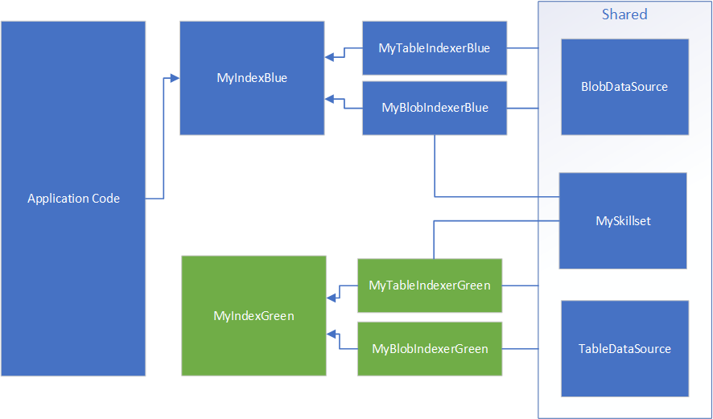

# Azure Search Recipes and Utils


# Deploy Script

How to rebuild an Azure Search Index without downtime.



## Deploy Azure Search Index and Indexer changes

Use the script deploy.sh to create blue/green instances of the same search index. This is useful to avoid downtime in case we need to rebuild an index and drop the existing one. 

Example:

```
$ ./deploy.sh ABCDABCD12341234 my-search prod blue
```

Pre-requisites: 

* [Azure Command Line](https://docs.microsoft.com/en-us/cli/azure/?view=azure-cli-latest)
* [jq](https://stedolan.github.io/jq/download/)
* On Windows you will need a linux bash, see WSL or [WSL2](https://docs.microsoft.com/en-us/windows/wsl/wsl2-install)

The script will deploy to a specific instance (blue or green), to avoid downtime your front-end should redirect to the **other** instance. See [How to rebuild and index in Azure Cognitive Search](https://docs.microsoft.com/en-us/azure/search/search-howto-reindex#how-to-rebuild-an-index)

1. Check the current used index, ej. artifactsblue
1. Deploy to the other index, ej. ./deploy.sh XXXXX my-search-prod prod green
1. Wait for the index to rebuild (could take several minutes depending on the amount of documents)
1. Change the setting to redirect to the new index, ej. artifacts
1. Deploy to the original index, ej. ./deploy.sh XXXX my-search-prod prod blue